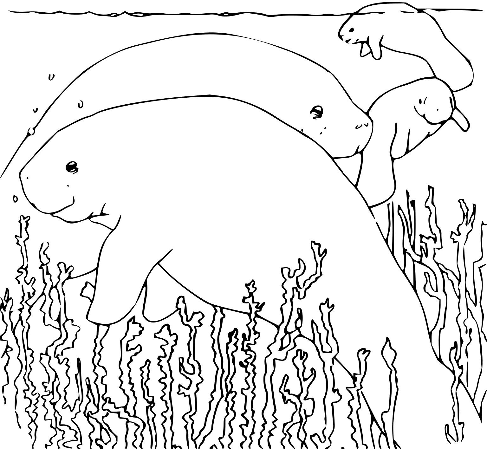

# TrustDB

Originally as a fork of OrbitDB: A peer-to-peer database on top of IPFS supporting, encryption, sharding and discoverability (searching). Peers are a organizing themselves into "trust" regions, hence the name "TrustDB". Within a trust region, secret information can be shared freely, this allow peers to create locally centralized database clusters with efficient replication, sharding, query yet still allowing cross trust region (low trust) activities, like relying encrypted and signed messages.

## 🚧 WIP 🚧  Use with caution
Below are descriptions of some modules

## BPayload [./packages/bpayload](bpayload)
- A generic payload class which you can extend and build binary serialization routines to and from with (@dao-xyz/borsh-ts). For example; Documents that are stored in the  BDocstore [./packages/orbit-db-bdocstore](bdocstore) could/should extend this class so when you are writing or querying data, you can be sure that results with be succesfully be deserialized with BinaryPayload class.

## BQuery  [./packages/bquery](bquery)
- Generalized query models/protocol for distributed queries

## BDocstore [./packages/orbit-db-bdocstore](bdocstore)
- Document store, but different from the "default" orbit-db implementation in the way serialization/deserialization is performed. In addition, this store supports querying. 

## BFeedStore  [./packages/bfeedstore](bfeedstore)
- Same as BDocstore but for "feedstore" (though docstore is superior in many aspects)

## BKVStore  [./packages/bfeedstore](bkvstore)
- Same as BDocstore but for "key value store" (though docstore is superior in many aspects)

## Dynamic Access Controller  [./packages/orbit-db-dynamic-access-controller](dca)
- "Chain agnostic" Access Controller

## Shard [./packages/shard](shard)
- Shard/Container for horizontally scaling databases. 
- Leader and leader rotation routines for building functionality around leaders
- Healthcheck/Redundancy diagnostics for shards.