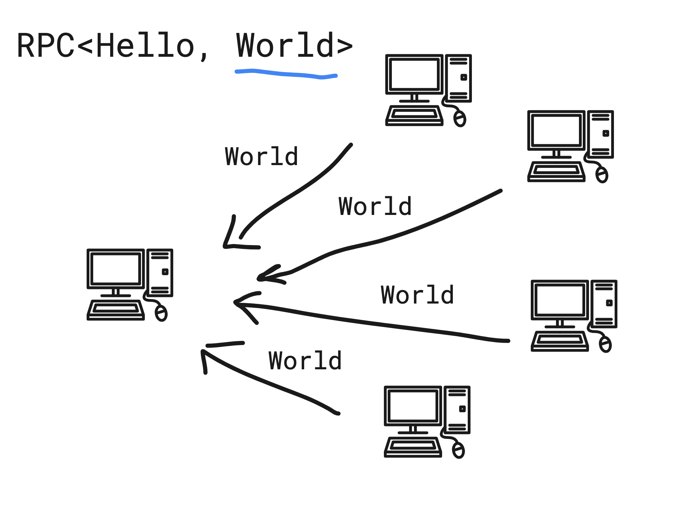

# RPC

This module contains a communication protocol for generic request-and-response communication. This allow you to send message to any peer in your network and wait for responses.

## Hello world example

Imports 

[imports](./rpc.ts ':include :fragment=imports')

Define message type

[imports](./rpc.ts ':include :fragment=definition-messages')

Define RPC roles (at least one Role is ideal to define to indicate what peers that have opened the RPC module are responders)

[imports](./rpc.ts ':include :fragment=definition-roles')

Define program that contains the RPC module

[imports](./rpc.ts ':include :fragment=definition-program')

Open the program with a requester peer and responder peer

[imports](./rpc.ts ':include :fragment=open')

Request using the requester

[imports](./rpc.ts ':include :fragment=request')

### Visualized 

    

    

See [Document store](https://github.com/dao-xyz/peerbit/tree/master/packages/programs/data/document) and [Clock Service](https://github.com/dao-xyz/peerbit/tree/master/packages/programs/clock-service) as implementation examples.
