# Resource-Aware Sharding

In distributed systems, sharding is an essential mechanism for distributing and managing data across multiple nodes. Adaptive sharding is a dynamic approach that adjusts data distribution based on various factors to optimize performance and resource utilization. This article delves into the implementation of adaptive sharding in Peerbit.

## The Goal
Starting from the end goal and working backward, the following are reasonable requirements that any distributed database should be able to adapt to:

(A) Controllable replication degree: Allow participants to agree on the data to be replicated at least N times, which should always be respected (if possible).

(B) Enable peers of different capacities to participate effectively: A more powerful computer should be able to do more work than a less powerful one.

(C) Efficient content retrieval: Use the knowledge from (A) to minimize the number of peers you have to ask for data.

Additionally, great Developer Experience (DX) is crucial and can sometimes influence the solutions you end up with. This was the initial idea for good DX when opening a database, where we control the minimum replication degree and provide resource constraints:

```ts
const peer = await Peerbit.create();
const db = peer.open("address", {
    args: {
        replicas: {
            min: 3
        },
        limits: {
            storage: 1e6, // limit storage to 1mb
            cpu: { max: 0.5 } // allow 50% CPU utilization
        }
    }
});
```

## The Problem with Existing Solutions
(A) and (B) can be seen as two forces acting on each other. On one hand, there's a force that makes nodes replicate as much as possible to satisfy the minimum replication degree. On the other hand, computers will eventually want to do as little as possible to save resources and, by extension, hardware and electricity costs.

For (A), we already have many solutions that work well but generally do not consider (B) and (C). For instance, in common DHT systems, we can use the identities of the participants to distribute content and pick neighbors to satisfy the minimum replication degree constraint.

<p align="center">
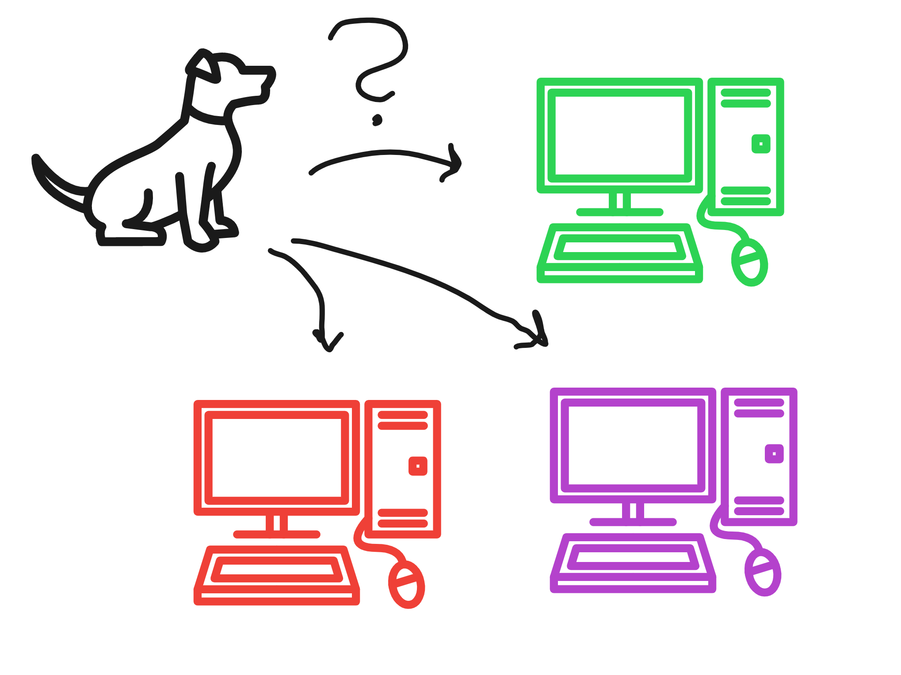
</p>


However, once you mix in constraints from (B), this quickly becomes more challenging because you can no longer rely on your neighbors being ready to help you with replication. If you then need to "skip" neighbors for this reason, it might become challenging to keep up-to-date information on where all the replicas are located.

Additionally, imagine the data being stored are images, and you want to find all images that represent dogs. How many peers do you need to ask at least if the minimum number of replicas is 1, 2, 3... to ensure you will certainly find all dogs? (Asking every peer will always work, but will not be feasible when the network is large)

## The Solution
The solution's concept is based on peers representing *ranges* instead of points on a line that loops around (or a circle). And instead of making the point/range start at their "id," we allow peers to place themselves anywhere they please. Below is a walkthrough of how this solves (A), (B), and (C).

### (A) Satisfying Replication Degree

For simplicity, we consider that every peer can only have one range. And that range has a "width" that represents how much they need to replicate at least. If the width is 0.5, it means they need to store 50% of all data.

A piece of data that needs to be stored will be stored at a location that depends on its hash. But instead of using the hash, we transform it into a number bounded by [0,1].

<p align="center">
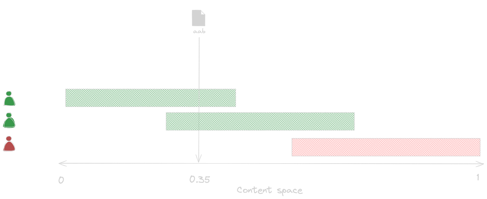
</p>

If the vertical line intersects with a range, that peer will be responsible for replicating this data. A nice consequence of this is that peers can participate with different degrees of trust in how much work others will perform.
<p align="center">
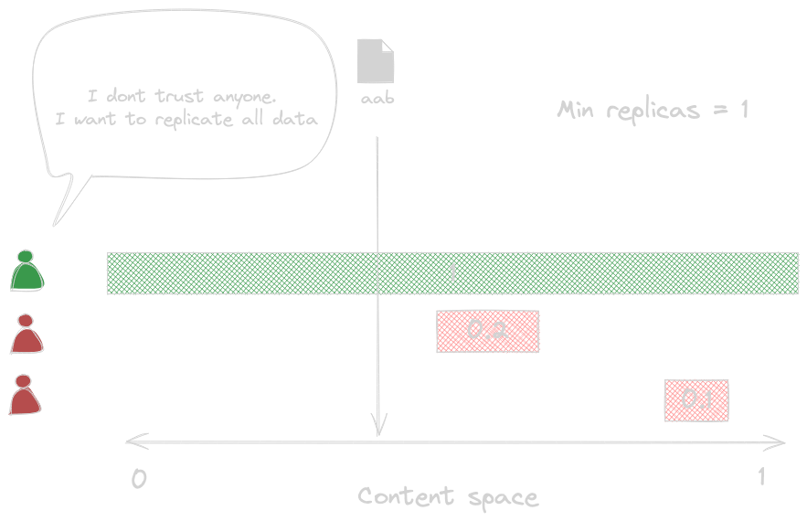
</p> 
By replicating with a factor (width) of 1, every data point will intersect the range, hence the node will always be responsible for every data point. This means that if anyone in a network creates data, it will always be sent to this peer. This is also useful property if you want to create an app where every peer always should hold the complete state locally at all times.

Another nice consequence of this is that if you only want to "pin" a specific data point, you only need to make your width as small as the floating points allow, to only cover that particular data point. *A line is a special case of a curve* and *pinning is a special case of range replication* (a range with width that approaches 0).

<p align="center">
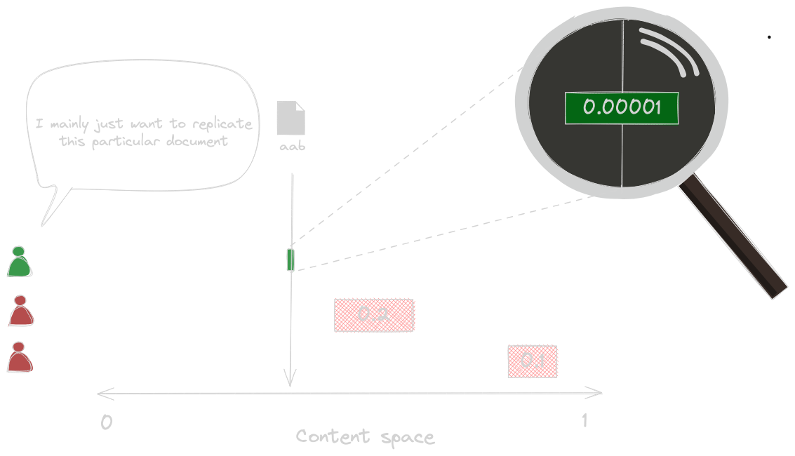
</p> 

If there is a gap, then the closest node will be chosen in the following way:
<p align="center">
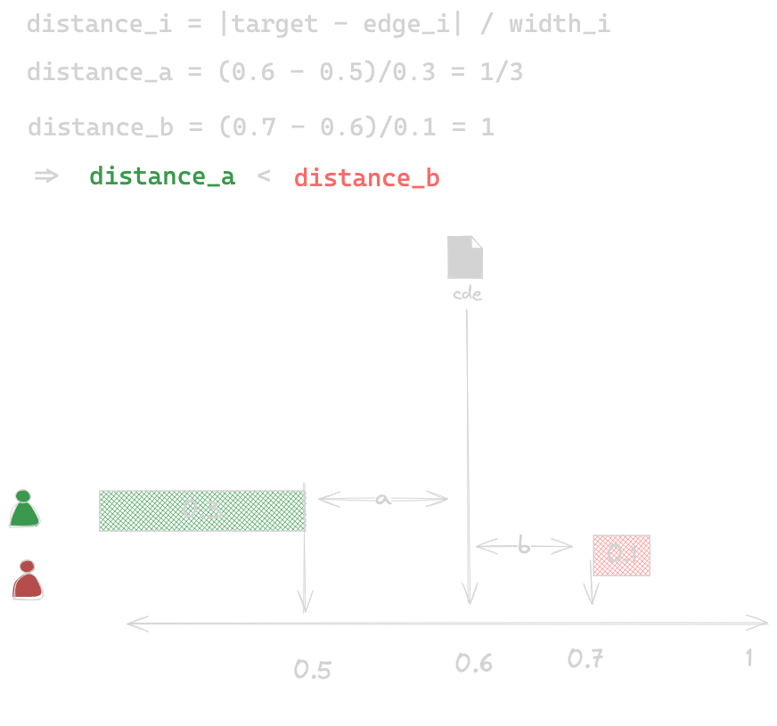
</p>

This means that even if the longer range is further away by measuring from the closest edge, it still needs to replicate the data due to that the transformed distance gets shorter because of the wider range. This property is important, because we wan't to make sure that someone who replicates with width 0 does not get delegated any replication work.

The “min replicas” (A) constraint is satisfied by delegating replicator responsibilities at `min replicas` amount, equidistant points, where the distance is `1 / min replicas`. If a replicator range covers one of these points, the replicator is responsible for persisting this entry.

The formula for the calculating the location of point `i` can be described as 

```point_i = (hash(content) + i / min replicas) mod 1```

and to find all points, do the calculation for

```i = {0, 1, ..., min replicas - 1}```


<p align="center">
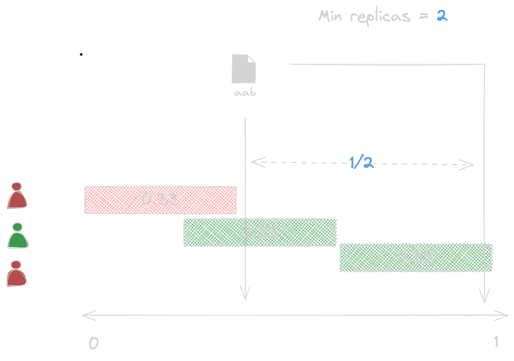
</p>

<p align="center">
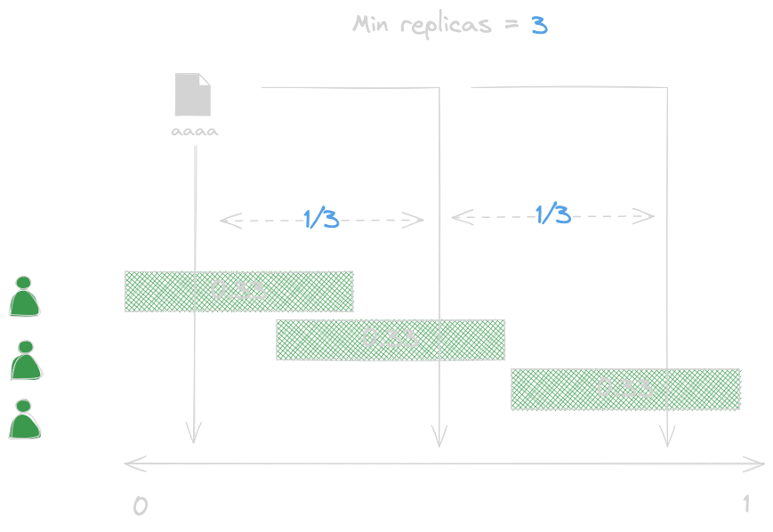
</p>

If you think of the content space as a circle, this would represent a rotation of `360° / min replicas`. So if `min replicas = 2` and the start point is the north pole, the second point would be the south pole.

But we will stick with the line representation because it will be easier to visualize (consider that everything just wraps around at 1 instead).

### (B) Resource Awareness

<p align="center">
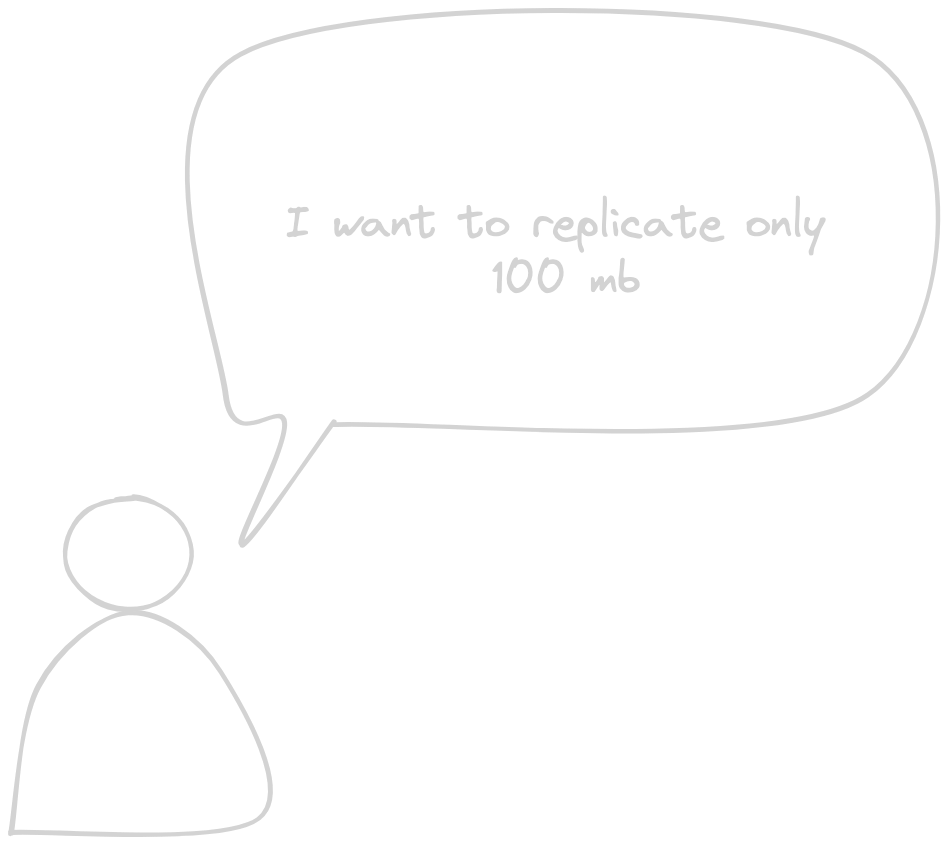
</p>

With this in (A) place, now it is time to consider constraint (B). The innovative step here is that we adjust our width to satisfy any resource constraint. Is the memory or CPU usage too high? Just reduce the width of your responsibility until satisfied. Do you have capacity? Then perhaps it would be helpful for others if you increase your width of responsibility.

<p align="center">
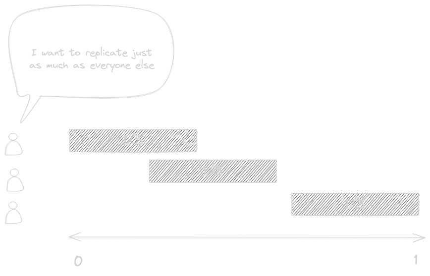
</p>


But this problem is actually more nuanced than just memory and CPU, for a healthy replication we also need to consider a few other goals.

<p align="center">
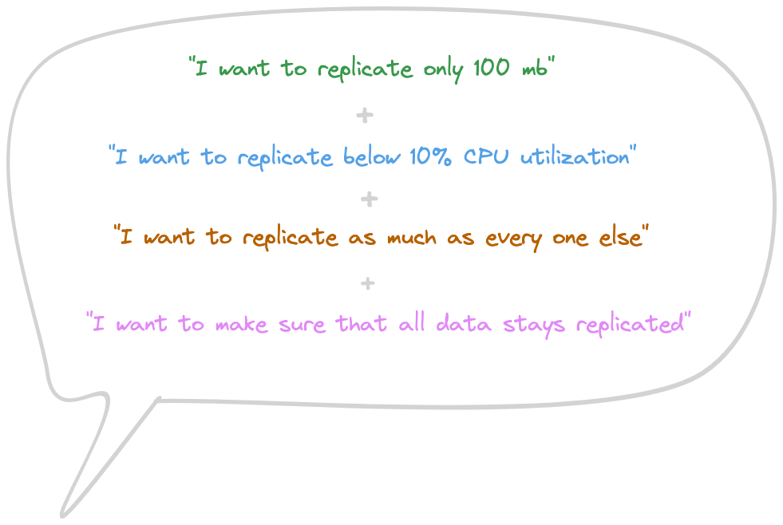
</p>


We cannot feasibly predict the optimal width for every participant in one go because we cannot continuously share all node info (CPU, memory, and other) usage to every other node at all times. Additionally, while data is inserted, storage-limited nodes will take up less width over time, so this is a continuous process. Therefore, the solution is to work iteratively where everyone adjusts their widths in small steps, and eventually the system converges to an optimal point.

For clarity these iterations on what happens when you update your width over time:
<p align="center">
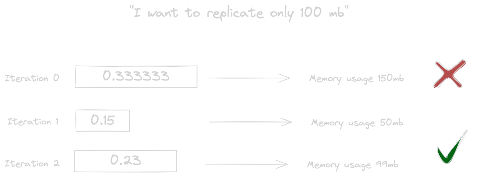
</p>


The iterative solver for this could take many forms. Assume this problem is of a convex nature, in that there is always a known direction we can update our width to get closer to what we want, then this means we can efficiently use gradient descent to reach the goal.

In practice, a special form of it that comes in the form of something that is called a [PID controller](https://en.wikipedia.org/wiki/Proportional%E2%80%93integral%E2%80%93derivative_controller) will be used. A PID controller has similar properties as an adaptive gradient optimizer like the Adam optimizer that uses first and second-order moments to more quickly iterate towards a solution. PID controllers are very common in heat-regulating systems that allow you to maintain a constant temperature in a house even if the outside temperature is changing, by regulating the power the radiators use. Very simplified, the PID controller equivalence here for the memory constraint is that the house temperature is the memory usage, the outside temperature is the total amount of data that exists, and the radiator power is the range width.

A simplified mathematical representation of the iterator looks like this:

<p align="center">
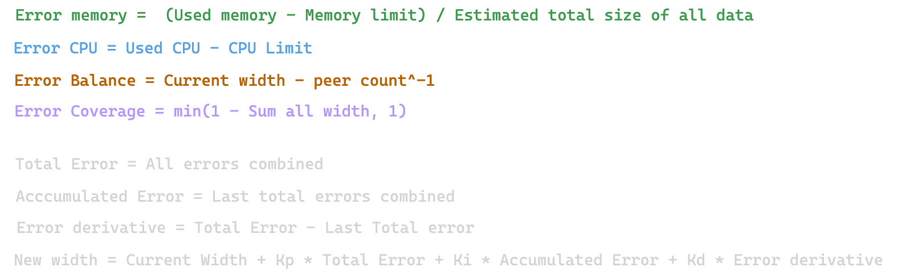
</p>


Simplified, we use [Lagrange relaxation](https://en.wikipedia.org/wiki/Lagrangian_relaxation) to combine constraints into a single comprehensive objective function.

When everything functions correctly, the width will converge to a specific number for each peer over time.

<p align="center">
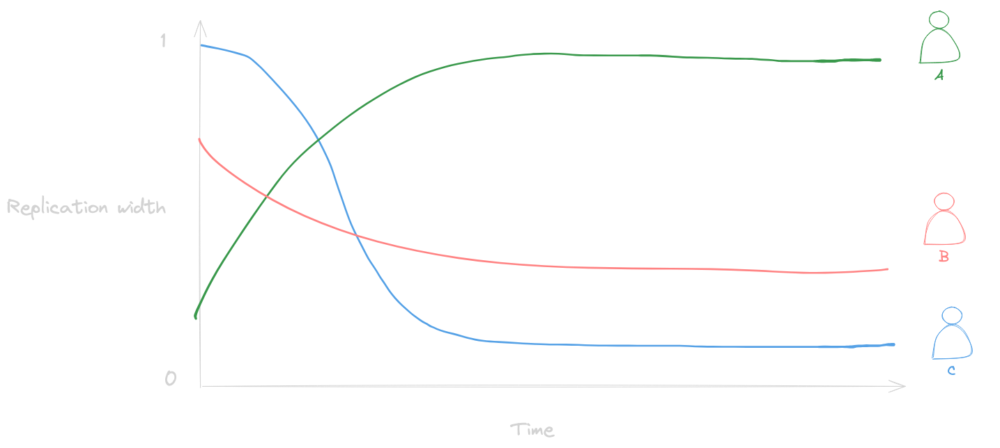
</p>

For better understanding, consider this analogy: it's as if we're trying to regulate the temperature in three houses simultaneously, where the thermostat in one house is influenced by the others. But the twist is that if one house requires less heating, another might need to compensate by heating more.

The source code for the PID controller is available [here](https://github.com/dao-xyz/peerbit/blob/master/packages/programs/data/shared-log/src/pid.ts).

### (C) Efficient Aggregation

This is the final component of the solution. How can we, using the method described in (A), efficiently aggregate all unique data points to locate all dog photos?

Simplified, the distribution method involves jumping by `1 / min replicas` for each replication. This ensures that if we "walk" along the axis with a distance of `1 / min replicas`, we will have the chance to encounter all the data (!).(Though there will be edge cases for handling gaps, around the boundaries of the start and end point of our walk).

A notable aspect of this approach is its "local first" nature. We begin our journey within our "range." For each step taken, we only require one node (unless redundancy in the search is desired), so if multiple ranges overlap, we consider only the one with the greatest width, minimizing the number of nodes we need to involve.

Below are illustrations of how aggregation is executed:

Start "local first":
<p align="center">
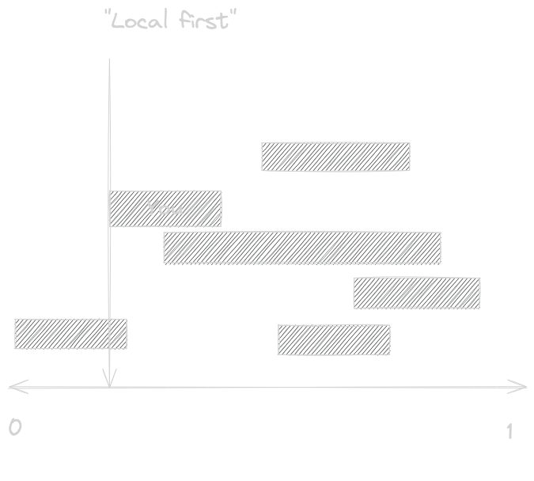
</p>

Determine the length of your "walk":
<p align="center">
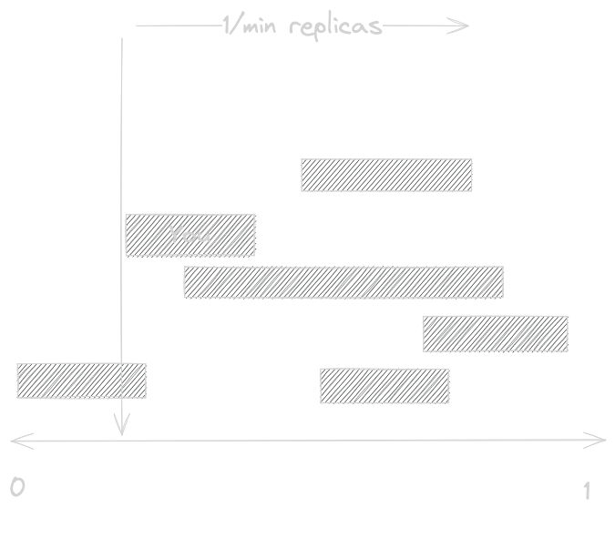
</p>

Aggregate every range and note its owner, but avoid considering more than one range per "step":
<p align="center">
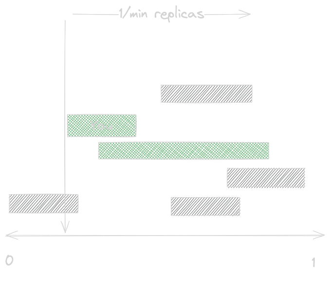
</p>

The source code for the aggregation is accessible [here](https://github.com/dao-xyz/peerbit/blob/95420cd37cb8d2ced4733495b6901b2b5e445e01/packages/programs/data/shared-log/src/ranges.ts#L155).

## Demo
The [file-sharing](https://files.dao.xyz) application demonstrates how this technology operates in real scenarios.

Initially, we observe peers receiving segments within the content space, with starting points independently determined based on the public key.


<video src="/content/docs/topics/sharding/storage-toggle.mp4" controls muted style="width: 100%" ></video>

When memory limitation is enabled, the ranges are observed to update accordingly to what we set the limit to. Also note on the top left "Used storage" and how that changes with the limit set.

Upon enabling CPU limitation, it's noticeable that minimizing a client's tab halts data replication. This occurs because a minimized tab is typically subject to significant throttling, thereby constraining processing capacity. However, once the tab is reopened, operations resume to their optimal state.

<video src="/content/docs/topics/sharding/cpu-toggle.mp4" controls muted  style="width: 100%"></video>

Explore this yourself and review the source code [here](https://github.com/dao-xyz/peerbit-examples/tree/master/packages/file-share).

## How to use this?
For example on how to use this in your app, read more [here](/modules/program/document-store/?id=role)

## Future Work and Improvements
### Scaling with Peers
As the number of replicators (or ranges/segments) increases, a scaling issue arises due to the necessity for each participant to be aware of all others, which becomes impractical. This challenge doesn't generally affect existing DHT solutions that leverage peer IDs and content addresses for logarithmic scaling of the size of routing tables with participation count.

In this system, the opportunity to utilize peer IDs in this manner is lost since peers are allowed to choose their "points" freely. However, a promising solution involves using recursion, as unlocked in (C). The concept involves creating one or more databases to monitor the replication ranges of peers:

"The loop":

Imagine constructing a database encompassing all responsibility ranges of another database as documents. With less data in this database, fewer replicators are needed, consequently reducing the metadata describing this database's responsibilities.

Apply "The loop" to define databases that outline the replication of the subsequent database. Ultimately, the "head" database becomes sufficiently small to serve as our "root" database. To interact with the database where actual content is stored, we can efficiently aggregate replicator ranges using (C) iteratively down the database chain until we reach the data. This solution resembles how partial routing tables function in common DHT systems but with controllable replication of these tables.

### Optimize Adjustment Frequencies

The gossip required to maintain an optimal setup depends on how quickly we want to reach a solution. While converging quickly can be beneficial, too much gossip will eventually become an overhead and impair performance. The current implementation needs future improvements to ensure that the convergence is correctly balanced against this overhead.

The parameters for the PID regulator might need to be adaptive, depending on network dynamics. In volatile networks, it might not be advisable to adjust your parameters too quickly in response to others. Finding optimal `Kp`, `Ki`, and `Kd` values that minimize convergence time and unnecessary data transfers would most likely require a more robust estimator capable of handling the probable non-linear properties. Therefore, neural network models would naturally be a suitable candidate here.

### Numerical Optimizers

As previously described, the resource optimization problem was solved with a PID controller, under the assumption that the problem has desirable "convex" properties. While this assumption may hold in many cases, there might be scenarios where more robust (and more resource-intensive) solvers would be preferable. For instance, when non-numerical properties and non-linear features are involved, a [Recurrent Neural Network (RNN)](https://en.wikipedia.org/wiki/Recurrent_neural_network) might perform better.
