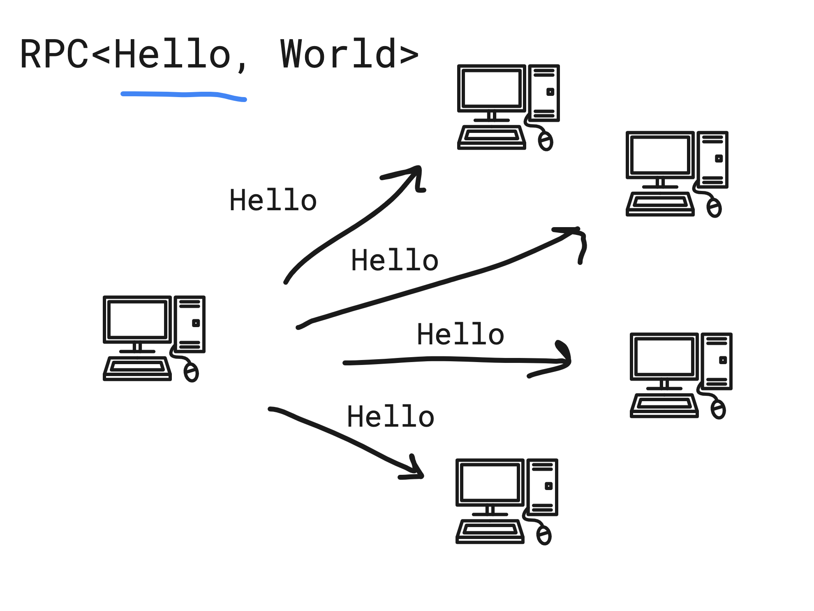

# RPC

This module contains a communication protocol for a generic request and response communication, this modules can be used as a component in other modules. See [LogIndex](./log-index), [DString](./../../data/string), [Documents](./../../data/document) for examples


## How it works

```typescript
@variant("hello")
class Hello {
    
    // add payload properties here
    constructor() {
       
    }
}

@variant("world")
class World {
    
    // add payload properties here
    constructor() {
       
    }
}

@variant("rpc-test")
class RPCTest extends Program {

    @field({ type: RPC })
    rpc: RPC<Hello, World>;

    async setup(): Promise<void> {
        await this.rpc.setup({
            responseType: Hello,
            queryType: World,
            context: this,
            responseHandler: (resp, from) => {
                return resp;
            },
        });
    }
}

// later (assume that some other peers also opens the RPCTest program)
const peer = await Peerbit.create ()
const rpcTest = peer.open(new RPCTest());

await rpcTest.rpc.send( new Hello(), (resp) => { console.log(resp)  })
```

### Visualized 

<p align="center">
    
</p>


<p align="center">
    
</p>

See [Document store](./../data/document) and [Clock Service](./../clock-service) as implementation examples